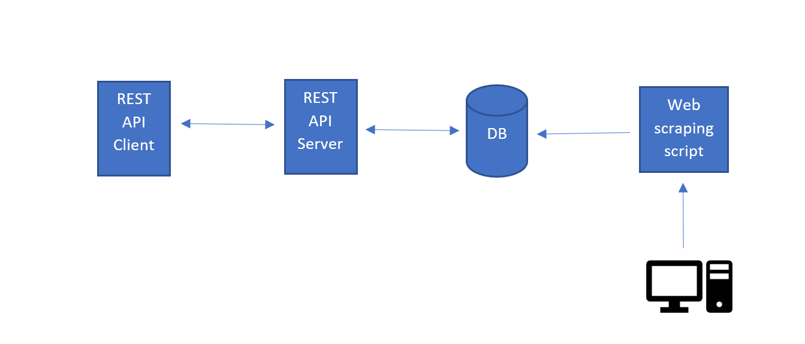

# RESTberry-Pi


# project architecture



# RESTberry-Pi

RESTberry-Pi is a Flask-based API server designed to run on a Raspberry Pi. It leverages a MySQL database and is fully containerized using Docker. 
## Features
- RESTful API endpoints for.
- MySQL database integration.
- Dockerized setup for easy deployment.

## Prerequisites
- Docker & Docker Compose installed.
- Raspberry Pi with Raspbian OS.
- Python 3.7+.

## Setup

1. **Clone the Repository**:
    ```bash
    git clone https://github.com/Ezzaldeen97/RESTberry-Pi.git
    cd RESTberry-Pi
    ```

2. **Environment Variables**:
   Create a `.env`  to set your environment variables:
    ```
    MYSQL_DATABASE=QAIA_DB
    MYSQL_USER=<user>
    MYSQL_PASSWORD=<>
    MYSQL_ROOT_PASSWORD=<>
    ```

3. **Create config.jso file**
   Your config.jso file should look something like this:
    ```
    {
        "db_host": "mysql_db",
        "db_port":"3306",
        "db_name":"QAIA_DB",
        "db_password" : "",
        "db_user": ""
    }
    ```
4. **Build and Run the Docker Containers**:
    ```bash
    docker-compose up --build
    ```

5. **Access the API**:
   The API will be accessible at `http://localhost:5000`.


## Contributing
Contributions are welcome! Please fork this repository 
